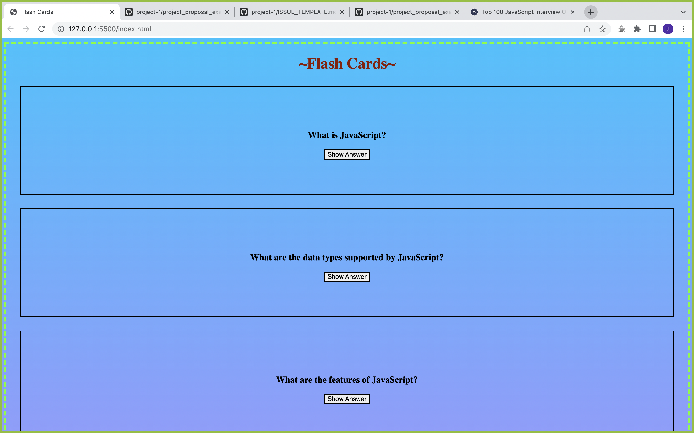
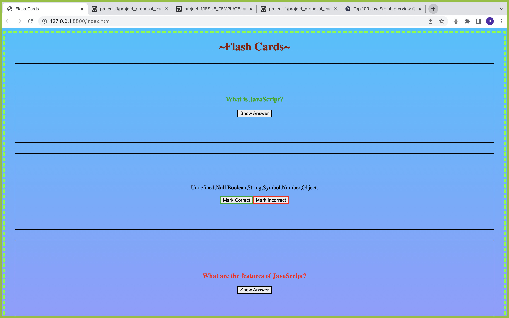

# Project Proposal

[Link to Project](https://pages.git.generalassemb.ly/urpatel899/Project-first/)

## Project Choice

- [x] Flash Cards
- [ ] Trivia (Self-scoring)
- [ ] Spaceman
- [ ] Tower of Hanoi
- [ ] Simon

## Project Description

This is a flash card. there are basic javascript question and answer. there are two button on back correct and incorect. first guess the answer and click on button base on your though. if you click on correct button the question will be in green and if you click incorrect the question will be in red color.

## Wire Frames

**Initial Landing View**

**Results View**

## User Stories

#### MVP Goals

- as a player, read the question on the flashcard.
- as a player, i want to show the answer.
- as a player, i want to guess the answer.
- as a player, i want to click the correct or incorrect button base on my thought.
- as a player, the question will be present in green text if the answer right and it will be present in red if it is wrong.
- as a player, i lerned javascript basic by flashcard.

#### Stretch Goals

- as a player, i want to animation background on result.
- as a player, i want music base on result.
- as a player, i want my score end of the game.
